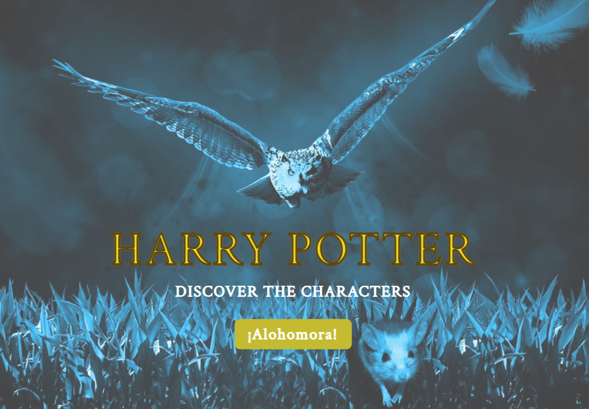

# 🧙‍♂️ ¡Explora el Mundo Mágico de Harry Potter! 🏰✨

## Descripción

En este emocionante proyecto, te sumergirás en el universo mágico de Harry Potter, donde podrás descubrir información sobre tus personajes favoritos. Con la ayuda de React, una poderosa biblioteca de JavaScript para la construcción de interfaces de usuario que te permitirá sumergirte en el mundo de la magia.

## Funcionalidades

### 1. Listado de Personajes

¡Haz clic en Alohomora y serás transportado suavemente a la sección donde podrás descubrir a todos los personajes de Harry Potter! Encontrarás información de cada personaje, incluyendo su foto, nombre y especie. ¡Prepárate para explorar la magia que rodea a cada uno de ellos!

### 2. Filtrado por Nombre

Con la función de búsqueda, podrás encontrar fácilmente a tus personajes favoritos escribiendo su nombre en el campo de búsqueda.

### 3. Filtrado por Casa

¿Quieres descubrir más sobre los personajes de una casa en particular? Con el filtro por casa, puedes seleccionar la casa que quieras y explorar solo los personajes que pertenecen a ella.

### 4. Detalles del Personaje

Al hacer clic en la tarjeta de un personaje, podrás acceder a información detallada sobre él. Desde su casa hasta su estado vital, género y especie.

## Tecnologías Utilizadas

- React
- React Router
- Hooks para las peticiones al servidor
- Uso de props para pasar datos a componentes hijos
- Uso de eventos en React para atender a interacciones del usuario
- React Router HashLink: para facilitar el desplazamiento suave a través de fragmentos de hash en la aplicación.
- Utilización de métodos funcionales de array (map, filter, etc.)
- Validación de props utilizando defaultProps y propTypes

¡Prepárate para embarcarte en una emocionante aventura en el mundo mágico de Harry Potter!
